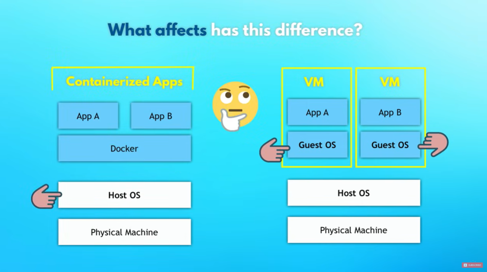

# Docker Fundamentals

## What in the World is it?

Once upon a time, when a team of developers needed to write some code, they would install all the dependencies they needed on their local machine. Whether it was this Python package, or that PostGres DB, or this run-time environment, or that config file, everything could be installed in different sets of OSes and using different installation steps.

**Enter:** Docker containers.

<figure>

<figcaption>
Source: <em>Docker — “But it works on my machine…” Then we’ll ship your machine!</em> by Aditya Singh
</figcaption>

</figure>

Docker is a piece of software that virtualizes (more on virtualization [later](#small-aside-virtualization)) applications. Docker images contain all the dependencies and runtime configurations you need to run a piece of software. This means that if you're a developer in a team, you can simply write out a few docker commands and.. VOILA, you're working with exactly the same type of software as your fellow coworker.

> Docker images are read-only files that contain all the binaries, configurations and files (like source code) that your app needs to run. Docker containers are the running instance of an image - the process that runs on its own isolated environment (["What is an image?"](https://docs.docker.com/get-started/docker-concepts/the-basics/what-is-an-image/), Docker).

With Docker, all of the packages/binaries you need will be installed in their own isolated environment, which means your OS can't come and mess them up... 🙄

The cool thing about this isolation is that you can run multiple versions of your software, all on the same machine!

## What About Deployment?

Before Docker (and its associates), deployment would involve a Dev and Ops teams. The Dev would give the Ops team an artifact of the app (like a `.jar` file) and a set of written instructions on how to set them up. Then, the Ops team would take the artifact and try to set it up on the _server_ using the included instructions.

This process is obviously not perfect. What if we miss a step in the instructions? What if the server environment differs from the dev environment?

**Enter:** Docker Artifacts

Now with Docker artifacts, the Ops team can simply set up the Docker runtime (one time only), and execute the Docker artifact.

Badabing. Badaboom.

<figure>

<figcaption> Source: The Office </figcaption>
</figure>

## Compared to Virtual Machines

Docker is distantly similar to virtual machines in terms of what they allow you to do: help run pieces of software in a _virtual_ environment.

### small aside: virtualization

In a nutshell, virtualization is about creating a layer of abstraction that gives you simpler/multiple access to hardware (["What is virtualization?"](https://www.ibm.com/think/topics/virtualization) by IBM). For example, a virtual storage may combine multiple storage drives and display them as one, combined storage drive. On the other hand, virtual machines allow a system's resources to be split up between multiple machines that can run different OS'es and applications.

---

The difference between Docker and Virtual machines is that virtual machines virtualize the OS kernel. This measn that they use their own OS kernel to run applications. Docker, on the other hand, uses the host system's OS kernel.

This means that Docker is more lightweight, and only takes a few seconds to start up. Virtual Machines on the other hand require a lot more overhead.

<figure>

<figcaption> Source: <em>Docker Crash Course for Absolute Beginners [NEW]</em> by TechWorld with Nana
</figure>

Buuuut, this hypothetically means that Docker containers that are built for the Linux kernel can't run on Windows. Which is why Docker created Docker Desktop, which comes with its own linux kernel (basically a virtual machine). Docker itself was built for Linux, so Docker Desktop also allows Docker to run on Windows and Mac.

## The commands 🫡

`docker images` gets you the images you locally have.

`docker ps` shows you the running containers (ps for processes)

`docker ps -a` shows you all running containers

`docker pull nginx:1.27.5` pulls nginx Ver.1.27.5 from DockerHub, the official docker registry.

`docker run nginx:1.27.5` runs nginx Ver.1.27.5 as a container, by creating a new container.

> Note: You don't have to pull before running a particular docker image. It's pulled automatically if you don't have it ✨

`docker run -d nginx:1.27.5` does the same, but runs it in the background, so its not blocking the terminal.

`docker run -d -p 3000:80 nginx:1.27.5` binds a docker container port 80 to the local host machine's port of 3000.

`docker run -d -p 3000:80 --name webapp nginx:1.27.5` creates and runs a new docker container with the name _webapp_.

`docker logs afd32$@#$#Sfdjo` gets you the logs of the running nginx with the aforementioned hash.

`docker stop afd32$@#$#Sfdjo` stops the nginx container with the aforementioned hash.

`docker start afd32$@#$#Sfdjo` starts an already created container.

## Registries

We mentioned earlier that docker pull uses the official docker registry: Docker Hub. Companies, however, may use private Docker registries like Amazon ECR to store Docker images. Within docker registries, repositories contain similar images with different versions.
