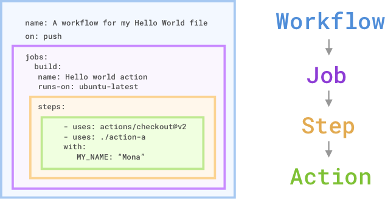

# Github Actions

Note about sources: A lot of the notes are based out of [Microsoft Learn's GH Actions Training Path](https://learn.microsoft.com/en-us/training/paths/github-actions/), provided as part of the GH Actions Certificate.

## Overview

So GH actions seems to target the whole CI/CD pipeline. Something confusing about it is that GH Actions refers both to the whole CI/CD platform and packaged scripts in a .yml format. although, there appears to be other files associated with GH actions, like dockerfiles and .js files.

## Types fo GH Actions

There are three types of GH actions: 

- containerized actions: containerized cause it includes the environment in the script. They're only run on a linux environment within github.
    - Ok something is a bit confusing here. They previously mentioned that GH actions follow a .yml format. But now, they mention that container actions "support many different languages". 
    - ok wait, i think "support" means that they work with different languages. the action itself is stil a .yml file.

- javascript actions don't include the environment. Why are they called javascript actions when actions are supposed to be .yml, i don't know.

- Composite action consist of multiple workflow steps.

### Example of Container Action

Here's an example of a GH action provided by the [Microsoft Learn Docs](https://learn.microsoft.com/en-us/training/modules/github-actions-automate-tasks/2-github-actions-automate-development-tasks). 

```yml
name: "Hello Actions"
description: "Greet someone"
author: "octocat@github.com"

inputs:
    MY_NAME:
      description: "Who to greet"
      required: true
      default: "World"

runs:
    uses: "docker"
    image: "Dockerfile"

branding:
    icon: "mic"
    color: "purple"
```

So it definitely seems that actions refer to the .yml file. 

## Workflows

Workflows are the mechanism that automates action execution. they can be triggered based on various events like a push/pull or a PR. 

They include at least one job, which a 'runner' executes. The runner can run on your machine, and it run on a machine or a container. The ones on Github run on a "virtualized" environment — I'm assuming a container. A job contains step(s).

This is a nice visual for how workflows contain job(s) which contain step(s) which refer to actions.

[](https://learn.microsoft.com/en-us/training/modules/github-actions-automate-tasks/2b-identify-components-workflow)

### Components

```yml
name: name-of-workflow
on: the-event-trigger

jobs:
    job-id
        name: name-of-job-to-display-on-gh-ui
        runs-on: name-of-runner
        steps:
            - uses: ./name-of-action
            with: the-arg-to-pass-to-action
            - uses: name-of-action-repo
```


