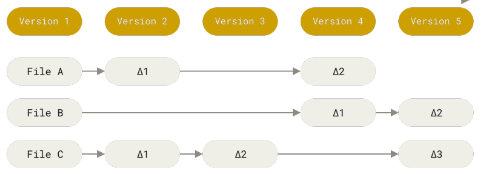
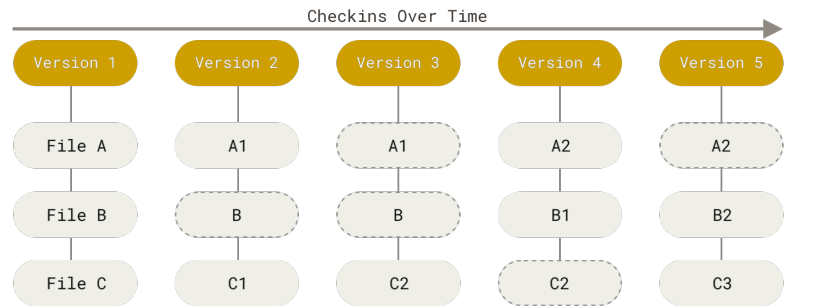

# git checkout git/pro_git

[][progit-docs]

## Mini History of Version Control

Version control is about recording different versions of a file or a set of files, so you can access them whenever you want to.

Naive version controlling is copy-pasting files into different directories. This is error-prone as we can forget which folder we copy pased into.

Then, comes VCSs (Version Control Systems) which consisted of a database holding the "revisions" made to a set of files. A popular VCS was RCS.

<figure>

<figcaption>Source: Pro Git 2, Figure 1 </figcaption>

</figure>

 

CVCSs (Centralized Version Control Systems) came as an upgrade over VCSs by offering a single server that multiple developers can use to access versioned files.

One of the issues with that is the single point of failure. If server goes down, then nobody can make any changes. If server corrupts without backups, then files and history go away, except for the "single snapshots" people has.

Then, distributed version control systems (DVCSs) step into the scene. When you access a versioned file, you dont just get that last snapshot, but you get its whole history history as well. So, its like every collaborator has a backup of the project. Git is a DVCS.

### How Git is Different

Git was intended to version control the Linux Kernel Project, so it's a VCS that's optimized for speed, scalability and heavy "non-linear development". Non-linear development refers to how you can branch off at a point in the project, and merge later after the project has progressed.

The major difference between Git and other VCS is that Git stores snapshots of your files, instead of the changes (delta-based version control) that were made.

Delta-based VC

<figure>

<figcaption> Source: Pro Git 2, Figure 4 </figcaption>

</figure>

 

Git Stream of Snapshots

<figure>

<figcaption> Source: Pro Git 2, Figure 5 </figcaption>

</figure>

## Features of Git

### Checksums

In Git, checksums are a series of alphanumeric chararacters constructed using your files' contents, and the SHA-1 hashing algorithm. They help maintain _integrity_ because Git uses them to detect any file changes.

### The Triple Trouble

Files can be in 3 different states:

- modified: File changed, but not committed.
- staged: File changed, and is set to be committed in the next snapshot.
- committed: File changed and stored in your database.

ALSO, your whole Git Project has 3 different sections:

- Working tree has a single snapshot (version) of your project on disc that you can modify.
- Staging area: Stores information about what will go on your next commit.
- Git directory: Stores metadata, and your versioned files.

-- Stopped: Page 26, Git Basics

<!--Markdown Links-->

[progit-docs]: https://git-scm.com/book/en/v2
