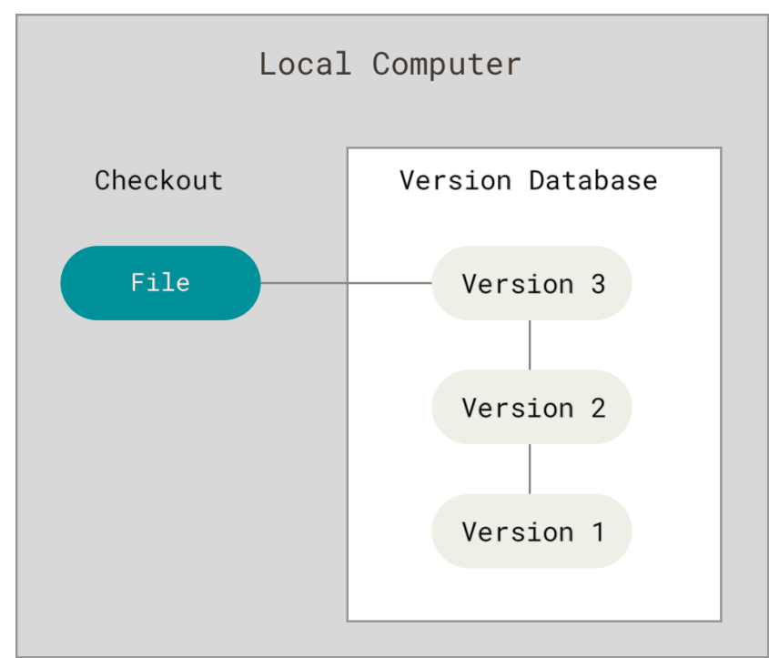

# git checkout git/pro_git

[][progit-docs]

## Mini History of Version Control

Version control is about recording different versions of a file or a set of files, so you can access them whenever you want to.

Naive version controlling is copy-pasting files into different directories. This is error-prone as we can forget which folder we copy pased into.

Then, comes VCSs (Version Control Systems) which consisted of a database holding the sets of changes made to a set of files.

<figure>

<figcaption>Source: Pro Git 2, Figure 1 </figcaption>

</figure>

CVCSs (Centralized Version Control Systems) came as an upgrade over VCSs by offering a single server that multiple developers can use to access versioned files.

-- Stopped: Page 18, Paragraph 2

<!--Markdown Links-->

[progit-docs]: https://git-scm.com/book/en/v2
