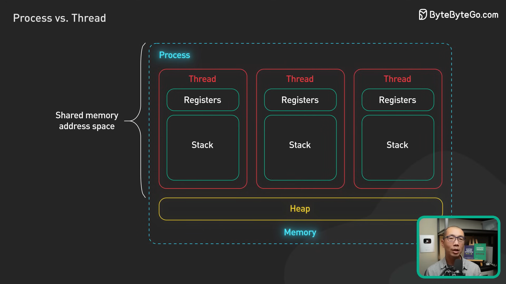

# LangGraph Pregel

## The First Steps

Starting with, the [LangGraph glossary][graph-gloss] mentions that their graph's algorithm uses _message passing_. This is because they pass the output of a node, as a message, onto other nodes.

LangGraph's graph algorithm proceeds in a series of iterations called "super steps". Each iteration consists of a set of nodes executing at the same time. The next super step consists of the next set of nodes executing at the same time.

All nodes start in an `inactive` state. When they receive a message, they become `active`. At the end of a super-step, nodes without incoming messages become `inactive`. The graph terminates when there are no incoming messages (all nodes are in inactive state).

The stuff about super-steps is inspired by Google's Pregel System.

I'm planning on taking 2 sidesteps here before diving into LanGraph code.

1. _Message passing_ seems to be an important concept. I should get a better understanding of it.

2. Google's Pregel system seems somewhat as well, so reading up on their research paper can be beneficial.

## Message passing

Alright I got hit with a lot of talk about concurrency and parallelism. Let's actually understand what the difference between the two is.

### Concurrency vs. Parallelism

Concurrency is about executing multiple tasks, such that their executions overlap with one another ("overlapping time periods").

<figure>

<figcaption>Image Source: <a href="https://jenkov.com/tutorials/java-concurrency/concurrency-vs-parallelism.html"> Jenkov </a></figcaption>

</figure>

 

Parallelism generally refers to executing multiple tasks in parallel.

So, concurrency is a "conceptual property" of a program. A concurrent program allows for mutliple tasks to execute alongside one another. Parallelism is a hardware property that usese multiple processors to execute multiple tasks.

Some definitions cite that concurrency doesn't always imply parallelism, and vice versa.

> Sources:\
> [Manning Free Content Center](https://freecontent.manning.com/concurrency-vs-parallelism/)\
> [Jenkov][jenkov-parallel]\
> [Oracle](https://docs.oracle.com/cd/E19455-01/806-5257/6je9h032b/index.html)

### Processes and Threads

A program is an executable file composed of a set of instructions.

When a program is loaded into memory and executed, it becomes a process. So, a processes is an instance of a program, along with a set of resources to execute the program. A process runs on its own memory space, which isolates it from other processes.

A process contains at least one thread, called the main thread. Threads are the units of execution that execute instructions. They contain a program counter along with other registers, and the stack. Threads of the same process share a memory space.

<figure>

<figcaption> Image Source: <a href="https://www.youtube.com/watch?v=4rLW7zg21gI&t=110s">  ByteByteGo </a> </figcaption>
</figure>

 

_Context switching_ is about running multiple processes or threads concurrently. It involves the OS saving the current state of a process or thread, and switching to execute, or continue executing another process or thread.

> Source:\
> [ByteByteGo](https://www.youtube.com/watch?v=4rLW7zg21gI)

#### Processes and Threads in Python

In Python, the concurrent.futures library serves as a high-level API for creating Processes and Threads. In Python's particular case, Processes allow for true parallelism by scheduling tasks on multiple cores. On the other hand, Python's Global Interpreter Lock only allows 1 thread to execute a particular piece of bytecode at any given time. So, multiple threads aren't truly parallel, and they instead execute asyncronously (interleaved with one another).

One might ask about the benefits of using threads compared to your average ol' asyncronous programming. Well, the most obious difference is that we're using the OS to context-switch between threads, instead of having coroutines yielding control of the CPU. This means the following:

- We can have hundreds of threads, but many times more coroutines.
- Each thread can have its own event-loop, giving it the ability to implement asyncronous programming per thread.
- Asyncronous programming means async functions and awaiting coroutines and creating tasks. It changes your code.

On the other hand, Processes in Python are inteded for CPU-intensive tasks. Moreover, objects passed between processes must be serializable.

> Source:\
> [superfastpython from Jason Brownlee](https://superfastpython.com/threadpoolexecutor-vs-asyncio/)

**New:** Python 3.13 released an experimental "free-threaded" mode that allows you to run threads in parallel, using multiple processors.

The code_examples folder shows examples for a method that is called using different processes, threads, and using async programming.

<!--Links-->

[graph-gloss]: https://langchain-ai.github.io/langgraph/concepts/low_level/#langgraph-glossary
[jenkov-parallel]: https://jenkov.com/tutorials/java-concurrency/concurrency-vs-parallelism.html
