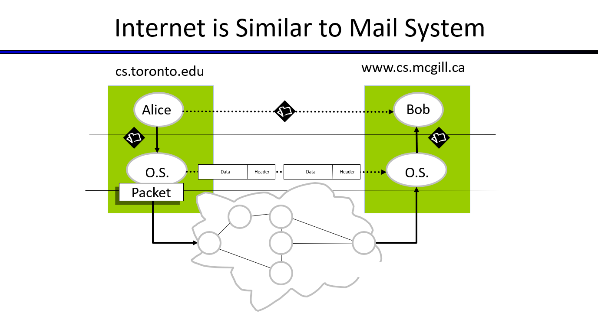

# Networking Networks

Instead of asking "What's the Internet", we're asking "How does the Internet work?"

## Networking Basics

A network is made up of 3 main elements:

- End Systems that send and receive data.
- Routers/Switches that forward data.
- Physical links that connect routers/swtiches and end devices together.

The general process of sending and receiving data over a network can be simpilified as follows:

1. An application forms a message, and sends it down to the OS.

2. The OS transforms the message into a series of packets and sends them over the network.

3. Routers and switches forward data between each other towards their destination address.

4. The OS combines the packets into a whole message using the provided ordering, and sends them up to the application.

### What is a Packet?

A packet generally contains 2 things:

- A header, which has the destination address. This is what Routers and Swiches care about.
- A payload, which is the actual data we wanted to send. This is what End Systems care about.

_Flow_ refers the flow of packets between end systems.

### End-to-End Principle

By nature, networks aren't perfect. They do not guarantee the arrival and correct ordering of packets.

The end-to-end principle refers to the idea that end devices are responsible for the reliability and ordering of packet delivery. This helps simplify down networks, and give you the choice of whether you want all packets to be delivered and reconstructed in order.

### Protocols

Protocols are sets of rules that govern how systems/devices send and receive data between one another. Specifically, protocols dictates the:

- Format of messages
- Ordering of messages
- The confirmation message once data is received

Remembered by the abbreviation: **FOR**, for format, order and receipt of messages.

## Practical 5-Layer Model

In the design of complex systems, we can use layers to encapsulate distinct operations. We can then use these layers to better understand how messages flow between end systems.

- Application Layer: A network application requests the OS to send a message using an API. This request includes the message, information about the destination, and what protocol to use to send the message. Some of the API's that the Application layer includes are the HTTP protocol, which uses HTTP messages that are made up of a header and body. Another API is IMAP - used in email.

- Transport Layer: Dictates how data is transferred between end-systems. This layer packetizes a message into a series of packets. Packets are mainly sent using the following 2 protocols:

  - TCP, which guarantees the delivery and ordering of packets.
  - UDP, which doesn't provide any guarantees.

- Network Layer: Contains the IP protocol and other routing protocols that dictate the route of a packet to its end destination. The IP Protocol, for examples, involves looking up a domain name on a DNS and adds to a packet the IP destination.

- Link Layer: Wifi vs Ethernet vs Fiber Optic, i.e. how messages are passed between network devices.

- Physical Layer: Bits on the wire, i.e. the physical transmission of bits.

1. So we start off with a message that an end system wants to send.
2. This message is then packetized into packets, and we decide the format, order and receipt of packets.
3. Then, we look at the general route a packet will take.
4. Then, we look at how packets move from one network device to the next.
5. Finally, we look at the physical transmission of a packet's bits from one network device to the next.

### OSI Model

The OSI model is a standard 7-layer model that models how data is sent and received between end devices.

- Layer 7: Application layer
- Layer 6: Presentation layer
- Layer 5: Session Layer
- Layer 4: Transport Layer
- Layer 3: Network Layer
- Layer 2: Link Layer
- Layer 1: Physical Layer

### Moving Through Layers

When a packet moves (down, from the sending device) through each layer, it is wrapped with additional data. When a packet moves up, each wrapper layer is removed. This process resembled Russian Dolls.
