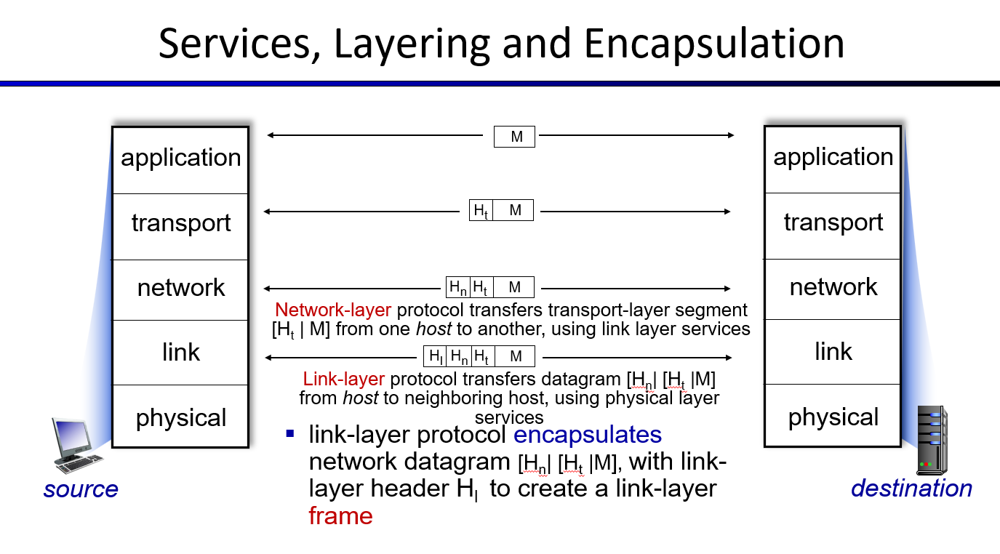

# Networking Networks

Instead of asking "What's the Internet", we're asking "How does the Internet work?"

## Networking Basics

A network is made up of 3 main elements:

- End Systems that send and receive data.
- Routers/Switches that forward data.
- Physical links that connect routers/swtiches and end devices together.

Here's an overly simplistic description of sending and receiving data over a network:

1. An application forms a message, and sends it down to the OS.

2. The OS transforms the message into a series of packets and sends them over the network.

3. Routers and switches forward data between each other towards their destination address.

4. The OS combines the packets into a whole message using the provided ordering, and sends them up to the application.

### What is a Packet?

A packet generally contains 2 things:

- A header, which has the destination address. This is what Routers and Swiches care about.
- A payload, which is the actual data we wanted to send. This is what End Systems care about.

_Flow_ refers the flow of packets between end systems.

### End-to-End Principle

By nature, networks aren't perfect. They do not guarantee the arrival and correct ordering of packets.

The end-to-end principle refers to the idea that end devices are responsible for the reliability and ordering of packet delivery. This helps simplify down networks, and give you the choice of whether you want all packets to be delivered and reconstructed in order.

### Protocols

Protocols are sets of rules that govern how systems/devices send and receive data between one another. Specifically, protocols dictates the:

- Format of messages
- Ordering of messages
- The confirmation message once data is received

Remembered by the abbreviation: **FOR**, for format, order and receipt of messages.

## Practical 5-Layer Model

In the design of complex systems, we can use layers to encapsulate distinct operations. We can then use these layers to better understand how messages flow between end systems.

- Application Layer: Concerned with exchanging messages between network applications. Contains a variety of protocols like HTTP and IMAP that send messages using the services of the Transport Layer.

- Transport Layer: Encapsulating messages with a transport-layer header, creating a **segment**. Encapsulation is mainly performed using one of the following protocols.

  - TCP, which guarantees the delivery and ordering of packets. TCP segments are called segments.
  - UDP, which doesn't provide any guarantees. UDP segments are called datagrams.

- Network Layer: Encapsulates a segment with a network-layer header containing destination IP address using the IP Protocol, and other routing protocols. This creates a **packet/datagram**. The IP Protocol involves looking up a domain name on a DNS to retreive the IP address + Port Number.

- Link Layer: Encapsulates packets/datagrams with a link-layer header to create a **frame**. This layer contains protocols like WIFI and Ethernet.

- Physical Layer: Bits on the wire, i.e. the physical transmission of bits.

1. Application Layer is concerned with other network applications.
2. Transport Layer is concerned with process to process.
3. Network Layer is concerned with Source to Destination IP.
4. Link Layer is concerned with neighboring network devices.

As a frame, packet or segment flows into a network device, it gets decapsulated up the layers. You can think of encapsulation and decapsulation as working with Russian Dolls.

### OSI & 4 Layer Model

The OSI model is a standard 7-layer model that models how data is sent and received between end devices.

- Layer 7: Application layer
- Layer 6: Presentation layer
- Layer 5: Session Layer
- Layer 4: Transport Layer
- Layer 3: Network Layer
- Layer 2: Link Layer
- Layer 1: Physical Layer

To make it simpler,, these layers can be abstracted into 4, which are:

- Application
- Transport
- Network
- Link
