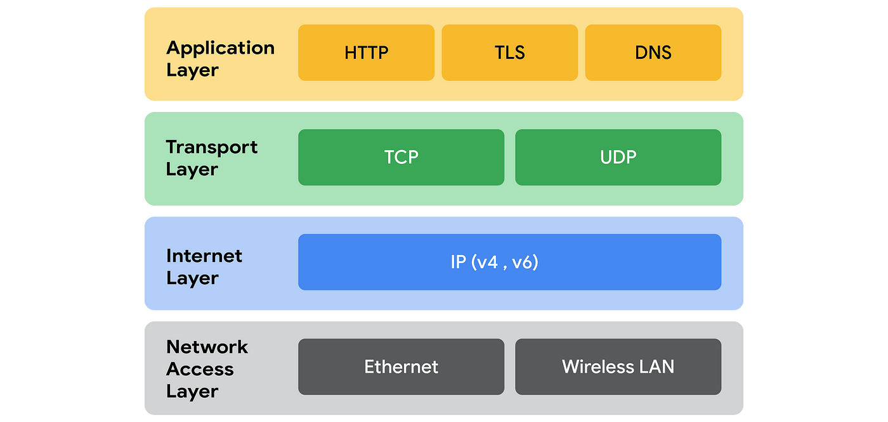

# The Full-Stack Life

Most of the information here is originally based out of the CSC309 course by Professor Kianoosh. External sources are added where relevant.

## Computer Talk for Dummies

For computers to talk to each other, they need an identifier. Think about how we use _names_ to call each other; computers need a name of their own as well.

Every computer that joins a network is given an identifier called an IP (Internet Protocol) Address. There are 2 main _versions_ of IP addresses:

- IPv4, where IP addresses are made up of 32 bits
- IPv6, where IP addresses are made up of 128 bits

Additionally, every computer has various logical (not hardware) channels called ports that an application can use to _listen_ in for a connection.

So, one computer to initiate contact with another, it will have to specify both an IP Address, and a port number!

> Side-note: Every computer has a local network with IP Addresses called loopback IP Addresses. These addresses identify the same computer.

The computer that sends in _requests_ is called a client, and the computer that is listening for requests is called a server. The server responds back with a _response_.

### DNS Servers

We can call the name of the website its domain name. When we type up its name and search for it, its IP Address and Port Number are looked up in Domain Name Servers (DNS). Moreover, so we don't end up with a chicken-egg problem, our computers know which DNS Server to reach out to.

## Network Primer

Here's a lil network primer before diving into more network talk.

A network is composed of 2 or more connected computers that share data with one another ([Britannica](https://www.britannica.com/technology/computer-network)).

The internet is composed of a series of connected networks.

The most common/official way that computers communicate data with one another is using the TCP/IP Protocol. This Protocol can be modeled with the _4-layer model_, which helps us better understand it:

**Example:**

When a web browser sends in a request, it starts off at the applicaiton layer with HTTP. Then, an HTTP message is packetized in the TCP layer. The destination server of each packet is then labeled using the IP layer. These packets are then sent over the Network Interface layer which actually transmits these packets from one computer to the next.

Example Source: [Lauren Dagworthy](https://www.youtube.com/watch?v=KEWe-5Bk3Q0&t=157s)

## Stateful and Stateless

Stateful means that we're keeping track of a client's past requests. Stateless means that every request is treated as a new request.

- TCP (Transmission Control Protocol) in the Transport Layer sets up a 2-way connection between 2 computers. Its stateful because it ensures that packets are transferred reliably.

- HTTP (Hypertext Transfer Protocol) in the Application Layer (runs over TCP) can be stateless if it doesn't keep of client requests (doesn't keep track of the server state).

Once a connection ends in TCP, the state data is lost.

## HTTP Messages

HTTP messages can be thought of strings in a special format.

HTTP messages are what the HTTP protocol uses to exchange data between a server and a client. HTTP messages are either requests or responses. They are made up of a header and a body.

HTTP method specifies the type of request that is being made. For example:

- **GET**: Signifies a READ operation
- **POST**: Signifies a CREATE operation
- **PUT**: Signifies an UPDATE operation
- **DELETE**: Signifies a DELETE Operation

The part of the url that comes after the domain name and slash is called the path. Use it to specify a specific page in a website.

HTTP always runs on port 80. The web browser helps render a variety of data types, including HTML.

> Additional Sources:
>
> - [MDN Web Docs](https://developer.mozilla.org/en-US/docs/Web/HTTP/Messages)
> - [Contrive](https://www.contrive.mobi/aviorapi/HTTPMETHODS.html)

### HTTP Response Status Codes

- 200-299: Succesful
- 300-399: Redirection
- 400-499: Client Errors
  - 400: Bad Request
  - 403: Permission Denied
  - 404: Page Not Found
- 500-599: Server Errors
  - 500: Internal Server Error

## The Amazing World of HTML
